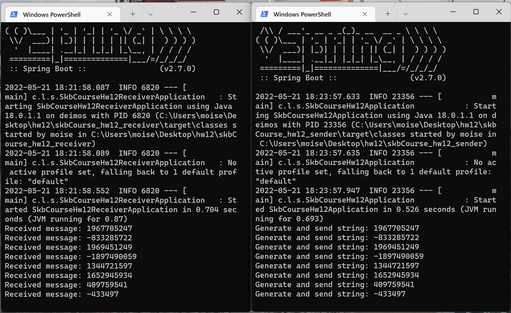

# java_skbCourse_hw12
## Message brokers
## Демонстрация работы

## Запуск
1. Укажите данные от ActiveMQ в `application.properties` (Для Receiver и Sender)
2. Запустите receiver командой: `mvn spring-boot:run`
3. Запустите sender командой: `mvn spring-boot:run`